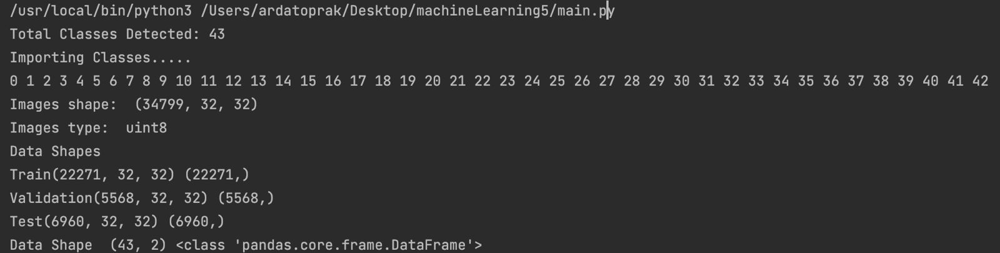

TRAFFIC SIGN RECOGNITION SYSTEM

Project Contributers:
	
	-Arda Toprak
	-Okan Çağlar
	-Tuğçe Doğru

Project Description:

 Aim of this project is to create machine learning system that detect and classify traffic signs in real time. We created two models to bring to life this machine learning system.  First part of the system is to detect the traffic sign object in real time, to accomplish this task we used yoloV8 machine learning model and trained it with custom traffic sign image dataset. Secondly we create our own model with Convolutional Neural Network to classify traffic sign images which came from yoloV8 model. We use image transformation to manage this machine learning model pipeline. YoloV8 detect the traffic sign, we crop the only traffic sign area of the image and give as an input to our classification model.
	
	
How did we train custom YoloV8 model?
	
we used yolo terminal command "yolo detect train data=./gtsrb.yaml model=yolov8n.pt epochs=100 imgsz=640 batch=16"

parameters:
	
 epochs: 100
 imgsz: 640 
 batch: 16

How did we create our custom model?

  --Set Parameters:
    Define various parameters for the project. These include the paths to the dataset and label files, the batch size, the number of epochs for training, image dimensions, and the ratios for splitting the dataset into training, validation, and test sets.

  --Load and Preprocess Images:
    Load the images from the specified directory. Convert the images to grayscale and resize them to ensure uniform dimensions. Assign class labels based on the folder structure.

  --Split the Data:
   Divide the loaded images and labels into training, validation, and test sets based on the defined ratios.

  --Verify Data Integrity:
   Check if the number of images matches the number of labels in each set and verify that the image dimensions are consistent.

  --Read Class Labels:
   Read the class labels from a CSV file to get the names of the classes for future reference and visualization.

  --Display Sample Images:
   Display a few sample images from each class to visually inspect the data and ensure it has been loaded correctly. This involves showing a subset of images from the training set with their corresponding class labels.

  --Display Data Distribution:
   Create a bar chart to visualize the number of images in each class within the training set. This helps in understanding the distribution of the dataset and identifying any class imbalances.

  --Preprocess the Images:
   Apply preprocessing steps to standardize the images. This includes histogram equalization to improve contrast and normalizing the pixel values to a range of 0 to 1.

  --Augment the Training Data:
   Use ImageDataGenerator to apply real-time data augmentation techniques such as width and height shifts, zoom, shear, and rotation to the training images. This helps in improving the model's robustness and generalization.

  --Define the CNN Model:
   Build the Convolutional Neural Network using Keras. The model includes several layers:

   Convolutional layers with ReLU activation for feature extraction.
   MaxPooling layers to reduce the spatial dimensions.
   Dropout layers to prevent overfitting.
   A Flatten layer to convert the 2D feature maps to 1D feature vectors.
   Dense layers for classification with a final softmax layer to output probabilities for each class.
  --Compile the Model:
   Compile the model using the Adam optimizer and categorical cross-entropy loss function. Also, specify the accuracy metric for evaluation.

  --Train the Model:
   Train the model using the training data generator. Validate the model using the validation set. Monitor the training and validation loss and accuracy over the epochs.

  --Evaluate the Model:
   After training, evaluate the model on the test set to determine its performance. Calculate the test loss and accuracy.

  --Save the Model:
   Save the trained model to a file for future use. This allows you to load the model later without retraining.

  --Plot Training History:
   Plot the training and validation loss and accuracy over the epochs to visualize the model's learning process and check for signs of overfitting or underfitting.

Some statistics of our model:

